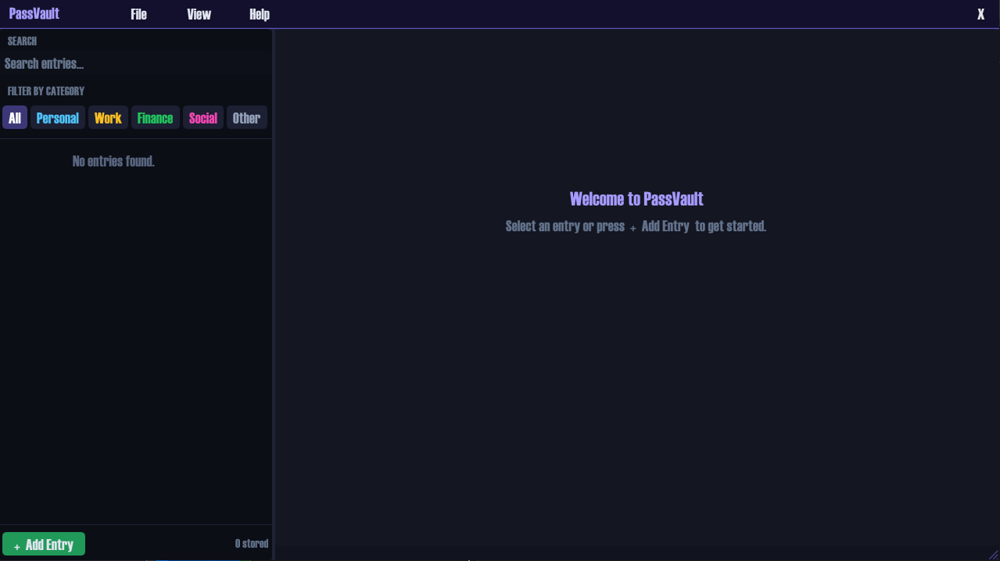

# PassVault 🔒

**A modern, lightweight, and fully offline password manager for Windows.**

Built in C++ using Dear ImGui, GLFW, OpenGL, and libsodium. No cloud. No accounts. Your passwords stay on your machine.

### ✨ Features
- Beautiful custom dark UI with drag-and-drop title bar
- Strong encryption using libsodium
- Built-in password generator with live preview
- Smart search + category filtering
- Color-coded categories (Personal, Work, Finance, Social, Other)
- Copy buttons + toast notifications
- Fully resizable window
- 100% local storage

### Tech Stack
- C++17
- Dear ImGui
- GLFW + OpenGL 3.3
- libsodium (crypto)
- Embedded Hatten font

### Getting Started
1. Clone the repository
2. Open the solution in Visual Studio
3. Build in Release or Debug mode
4. Run `Password Manager.exe`

Your encrypted vault is created automatically on first launch.

### License
This project is licensed under the MIT License — see the [LICENSE](LICENSE) file for details.

Third-party libraries are listed in [THIRD_PARTY_LICENSES.txt](THIRD_PARTY_LICENSES.txt).

---

Made with ❤️ in San Antonio, Texas.