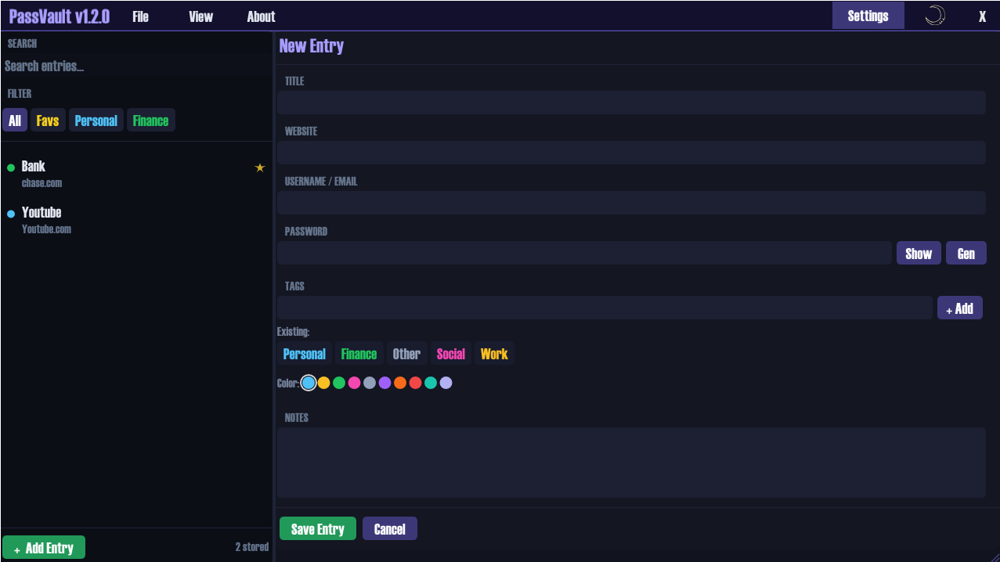

# PassVault 🔒

**A modern, lightweight, and fully offline password manager for Windows.**

Built in C++ with Dear ImGui. No cloud. No accounts. No telemetry. Your data never leaves your machine.

### ✨ Key Features

- **Beautiful custom dark UI** with drag-and-drop title bar
- **Strong AES-256 + XChaCha20 encryption** (libsodium)
- **Built-in password generator** with real-time strength preview
- **Smart search + filtering** by category or custom tags
- **Custom tags** with fully customizable colors
- **Star / Favorite** important logins
- **Export / Import** encrypted vaults (secure backup & restore)
- **Self-updating** — checks for new versions automatically
- **Copy buttons** with toast notifications
- Fully resizable + remembers window position
- 100% local storage — vaults saved as `.pv` files

### 🚀 Downloads (v1.3.0)

- **[PassVault-v1.3.0-Setup.exe]** (Recommended - Installer)  
  [Download](https://github.com/jemile/PassVault/releases/download/v1.3.0/PassVault-v1.3.0-Setup.exe)

- **[PassVault-v1.3.0-Win64.zip]** (Portable)  
  [Download](https://github.com/jemile/PassVault/releases/download/v1.3.0/PassVault-v1.3.0-Win64.zip)

**System Requirements:**
- Windows 10 or 11 (64-bit)
- Installation or just extract & run

> **Note:** x86 (32-bit) build is currently not supported.

### Tech Stack

- C++17
- Dear ImGui + custom renderer
- GLFW + OpenGL 3.3
- libsodium (crypto)
- Embedded Hatten font
- Embedded Sun and Moon font

### Getting Started

1. Download and run the installer or portable version
2. Create a new vault and set a **strong master password**
3. Start adding your logins

Your vault is automatically encrypted and saved locally.

### Screenshots

*(Add more screenshots here later)*

### License

This project is licensed under the **MIT License** — see the [LICENSE](LICENSE) file for details.

Third-party licenses are listed in [THIRD_PARTY_LICENSES.txt](THIRD_PARTY_LICENSES.txt).

---

**Made with ❤️ in San Antonio, Texas.**

---

**Questions?** Feel free to open an issue on GitHub!
